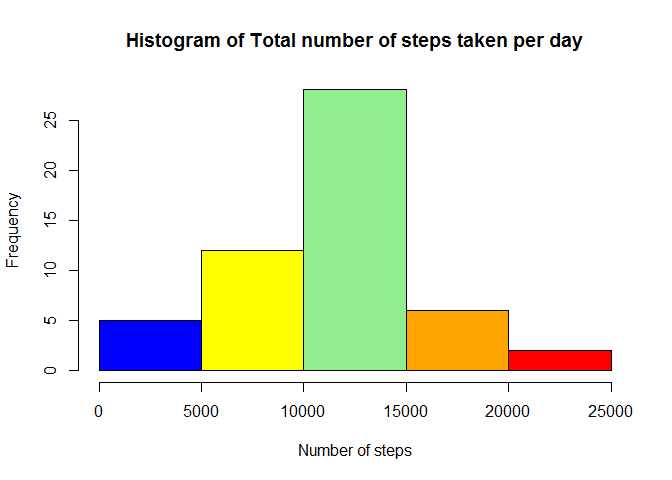
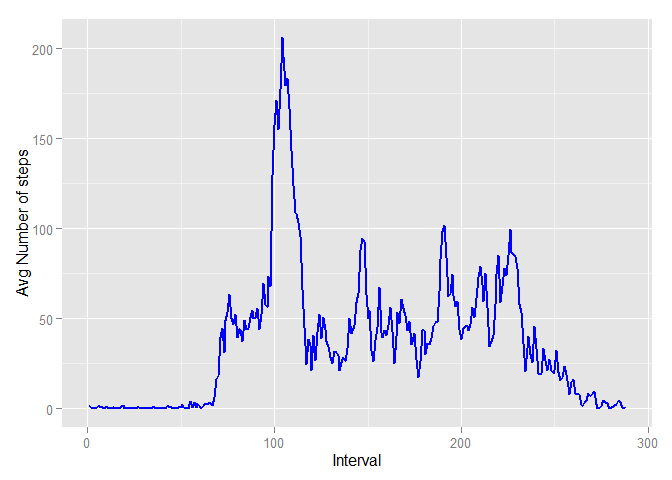
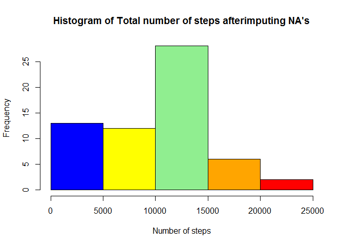
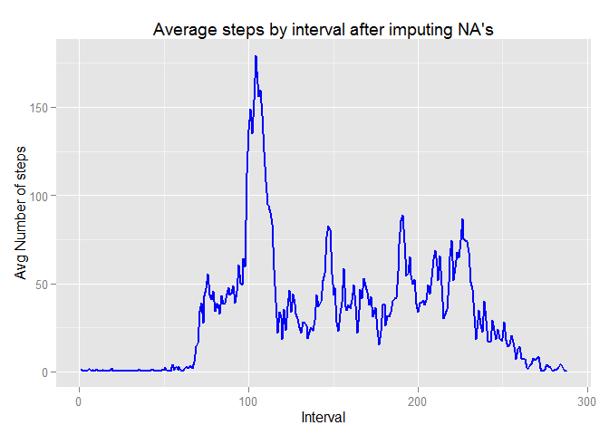
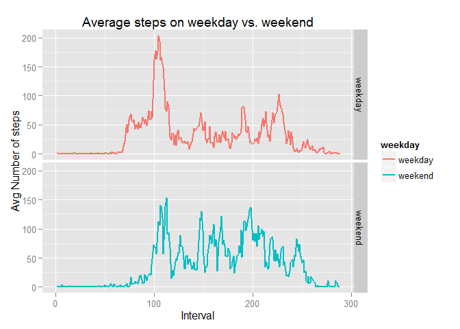

# Reproducible Research: Peer Assessment 1
  
  
## Introduction
  
  
This report is produced for assignement #1 of the course "Reproducible Research", on Coursera. The instructions for this assignement are described in Readme.md at https://github.com/rdpeng/RepData_PeerAssessment1.

```r
knitr::opts_chunk$set( fig.path='figures/',
                      echo=TRUE, warning=FALSE, message=FALSE)
```
  
## Loading and preprocessing the data
  
  

```r
        require(data.table)
        require(ggplot2)
        
        # Read the CSV file from current working directry
        act <- read.csv("activity.csv", stringsAsFactors = FALSE)
        act <- data.table(act)

        # The intervals are represented as hrs and min, instead make them easier to plot
        x <- 1:288
        act[, interval := x]
```

```
##        steps       date interval
##     1:    NA 2012-10-01        1
##     2:    NA 2012-10-01        2
##     3:    NA 2012-10-01        3
##     4:    NA 2012-10-01        4
##     5:    NA 2012-10-01        5
##    ---                          
## 17564:    NA 2012-11-30      284
## 17565:    NA 2012-11-30      285
## 17566:    NA 2012-11-30      286
## 17567:    NA 2012-11-30      287
## 17568:    NA 2012-11-30      288
```


## What is mean total number of steps taken per day?
  
  
For this part of the assignment, I am ignoring the missing values in the dataset.

1.Make a histogram of the total number of steps taken each day


```r
        sum_by_date <- act[, .(sum = sum(steps)), by=date]
        colors = c("blue", "yellow", "lightgreen", "orange", "red")
        hist(sum_by_date$sum, main = "Histogram of Total number of steps taken per day", col = colors,
                xlab = "Number of steps")
```

 

2.Calculate and report the mean and median total number of steps taken per day


```r
        (mean_total_steps <- mean(sum_by_date$sum, na.rm = TRUE))
```

```
## [1] 10766.19
```


```r
        (median_total_steps <- median(sum_by_date$sum, na.rm = TRUE))
```

```
## [1] 10765
```

## What is the average daily activity pattern?


1.Make a time series plot (i.e.  type = "l" ) of the 5-minute interval (x-axis) and the average number of steps taken, averaged across all days (y-axis)  

Note: The 5-minute intervals are pre-processed in step 1 to be in the range of 1:288.


```r
        avg_daily_steps <- act[, .(avg = mean(steps, na.rm=TRUE)), by=interval]
        p1 <- ggplot(avg_daily_steps, aes(x=interval, y=avg))
        p1 + geom_line(linetype = "solid", size = 1.0, color="blue") + labs(x="Interval", y="Avg Number of steps")
```

 

2.Which 5-minute interval, on average across all the days in the dataset, contains the maximum number of steps?


```r
        (max_avg_steps_interval <- avg_daily_steps[which.max(avg_daily_steps$avg)]$interval)
```

```
## [1] 104
```

## Imputing missing values

Note that there are a number of days/intervals where there are missing values (coded as  NA ). The presence of missing days may introduce bias into some calculations or summaries of the data.

1.Calculate and report the total number of missing values in the dataset (i.e. the total number of rows with  NA's)

```r
        (num_na <- nrow(act[is.na(act$steps)]))
```

```
## [1] 2304
```

2.Devise a strategy for filling in all of the missing values in the dataset. The strategy does not need to be sophisticated. For example, you could use the mean/median for that day, or the mean for that 5-minute interval, etc.


**Strategy:**

- Take avg_daily_steps calculated in the previous step  

- Get the interval for which steps = NA in original dataset  

- Match the interval in avg_daily_steps data table and get the corresponding steps  

- Round the number and assign it to the original dataset


3.Create a new dataset that is equal to the original dataset but with the missing data filled in.


```r
        act2 <- act
        act2$steps[which(is.na(act2$steps))] <- round(as.numeric(avg_daily_steps[match(act$interval, avg_daily_steps$interval), 2]))
        act2
```

```
##        steps       date interval
##     1:     2 2012-10-01        1
##     2:     2 2012-10-01        2
##     3:     2 2012-10-01        3
##     4:     2 2012-10-01        4
##     5:     2 2012-10-01        5
##    ---                          
## 17564:     2 2012-11-30      284
## 17565:     2 2012-11-30      285
## 17566:     2 2012-11-30      286
## 17567:     2 2012-11-30      287
## 17568:     2 2012-11-30      288
```

4.Make a histogram of the total number of steps taken each day and Calculate and report the mean and median total number of steps taken per day. Do these values differ from the estimates from the first part of the assignment? What is the impact of imputing missing data on the estimates of the total daily number of steps?


```r
        sum_by_date2 <- act2[, .(sum = sum(steps)), by=date]
        hist(sum_by_date2$sum, main = "Histogram of Total number of steps afterimputing NA's", col = colors,
             xlab = "Number of steps")
```

 


```r
        (mean_total_steps2 <- mean(sum_by_date2$sum))
```

```
## [1] 9429.77
```


```r
        (median_total_steps2 <- median(sum_by_date2$sum))
```

```
## [1] 10395
```

- Mean total number of steps taken per day has **reduced** from **10766.19** to **9429.77**

- Median number of steps taken per day also **reduced** from **10765** to **10395**


5.**Revised time series plot after imputing NA values**, of the 5-minute interval (x-axis) and the average number of steps taken, averaged across all days (y-axis)  


```r
        avg_daily_steps2 <- act2[, .(avg = mean(steps, na.rm=TRUE)), by=interval]
        p2 <- ggplot(avg_daily_steps2, aes(x=interval, y=avg))
        p2 + geom_line(linetype = "solid", size = 1.0, color="blue") + labs(x="Interval", y="Avg Number of steps", title="Average steps by interval after imputing NA's")
```

 

- Since my imputing strategy was to add the average daily steps in a given interval to the missing values, the pattern of daily steps across intervals has not changed, as can be seen in the above chart.

## Are there differences in activity patterns between weekdays and weekends?


1.Create a new factor variable in the dataset with two levels -- "weekday" and "weekend" indicating whether a given date is a weekday or weekend day.


```r
        act2[, weekday:= weekdays(as.Date(act2$date))]
```

```
##        steps       date interval weekday
##     1:     2 2012-10-01        1  Monday
##     2:     2 2012-10-01        2  Monday
##     3:     2 2012-10-01        3  Monday
##     4:     2 2012-10-01        4  Monday
##     5:     2 2012-10-01        5  Monday
##    ---                                  
## 17564:     2 2012-11-30      284  Friday
## 17565:     2 2012-11-30      285  Friday
## 17566:     2 2012-11-30      286  Friday
## 17567:     2 2012-11-30      287  Friday
## 17568:     2 2012-11-30      288  Friday
```

```r
        act2$weekday <- as.factor(act2$weekday)
        levels(act2$weekday) <- list( weekday = c("Monday", "Tuesday", "Wednesday", "Thursday", "Friday"),
                                     weekend = c("Saturday", "Sunday"))
        act2
```

```
##        steps       date interval weekday
##     1:     2 2012-10-01        1 weekday
##     2:     2 2012-10-01        2 weekday
##     3:     2 2012-10-01        3 weekday
##     4:     2 2012-10-01        4 weekday
##     5:     2 2012-10-01        5 weekday
##    ---                                  
## 17564:     2 2012-11-30      284 weekday
## 17565:     2 2012-11-30      285 weekday
## 17566:     2 2012-11-30      286 weekday
## 17567:     2 2012-11-30      287 weekday
## 17568:     2 2012-11-30      288 weekday
```

2.Make a panel plot containing a time series plot (i.e.  type = "l" ) of the 5-minute interval (x-axis) and the average number of steps taken, averaged across all weekday days or weekend days (y-axis). 


```r
        avg_daily_steps3 <- act2[, .(avg = mean(steps)), by=.(interval,weekday)]
        p2 <- ggplot(avg_daily_steps3, aes(x=interval, y=avg, color = weekday)) 
        p2 <- p2 + geom_line(linetype = "solid", size=1.0) + facet_grid(weekday ~ .) + labs(x="Interval", y="Avg Number of steps", title="Average steps on weekday vs. weekend")
        p2
```

 
